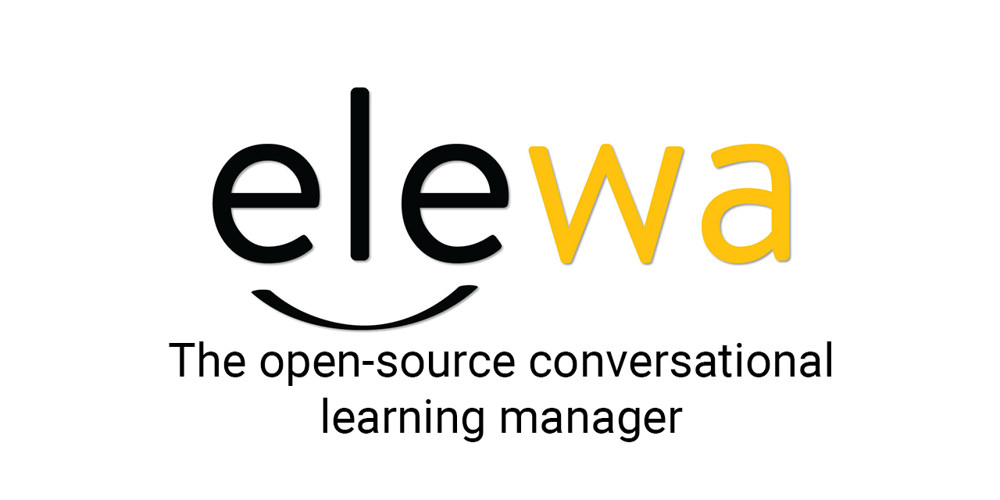

<div align="center">
 <a href="https://elewa.education">
    
  </a>
</div>

<!-- # The Elewa LMS -->

<div>

  <h2>Learning as simple as having a conversation!</h2>
  <br/>

  <p>
    The Elewa LMS is worlds first conversational learning manager. The Elewa LMS allows you to build, host and manage courses that run over a conversational platform such as WhatsApp, Telegram, Messenger or our very own web platform. And best of all, it's fully open source!
  </p>

  <p>
    The Elewa LMS packs three elements:
    
  - **A conversation builder**. 
  
    A drag-and-drop editor for building chatbot conversations/stories.

  - **Chatbot channel management & hosting**. 
  
    The ability to connect different channels to the chatbot manager and to link conversations/stories. This includes channel registration such as WhatsApp Business API registration on the platform.

  - **Conversational system**
  
    Mirror of chat(bot) conversations with a user and the ability to take over from the bot and have direct chat with a participant and to guide the participants to parts of the application.

  </p>

</div>

<h3><b>Contributing</b></h3>

To contribute, refer to the [iTalanta/Moringa Open-Source](https://github.com/italanta/open-source) Documentation.

<h3><b>Partners:</b></h3>

  <a href="https://italanta.net/for-devs">
    
  </a>
  
  <br/>
  
  <a href="https://moringaschool.com/">
    &nbsp;
  </a>


Contributions are always welcome!

Follow the steps below to start contributing on the project via pull requests:

```
Create a new branch for your changes by running
```
```bash
  git checkout -b [branch name]
```
```
Make the desired changes to the code on your local machine.
Commit the changes to your local repository by running 
```
```bash
  git commit -am '[commit message]
```
```
Push the changes to your forked repository on Github by running
```
```bash
  git push origin [branch name]
```
```
Go to the elewa repository and create a new pull request by clicking on the "New pull request" button.
Select the branch that contains your changes and compare it with the main branch of the original repository.
Add a detailed description (Using our PR template provided) of the changes made and submit the pull request.
Submit the pull request.
```

#### Note:

It is always a good practice to check the open source project's contributing guide before making any changes.

It is also recommended to keep your fork updated with the original repository by syncing your fork. 
You can do this by adding the original repository as a remote: 

```bash
  git remote add upstream [URL of original repository]
```
then fetch the changes and merge them with your local branch : 

```bash
  git fetch upstream
  git merge upstream/main
```


Also it is good to communicate with the maintainers or other contributors, you can do this by opening an issue or leaving a comment on the pull request you created.

Please adhere to this project's `code of conduct`.


## Tech Stack

Our application is built using Angular, a popular JavaScript framework for building web and mobile applications, and TypeScript, a superset of JavaScript that adds optional static typing and other features.

Here is a brief overview of how the application is structured:

- Components: The building blocks of the application, responsible for displaying the UI and handling user interactions. Each component has its own template, styles, and logic, and can be nested inside other components.

- Services: Classes that handle the business logic of the application, such as accessing an API or manipulating data. Services can be injected into components to share functionality across the application.

- Routes: Define the different URLs of the application and which component should be displayed for each route.

- Modules: Group related components, services, and routes together. Each module has its own set of imports, declarations, and exports, which define what should be available to other modules in the application.

- TypeScript: The application uses TypeScript, a superset of JavaScript that adds optional static typing, classes, interfaces and other features. That makes the development more robust and reliable.

- Interfaces: are used to define the types of the variables and objects in the application.

- Decorators: are used to add metadata to classes, methods, and properties, which can be used by Angular to configure the application.

- Observables: We use the RxJS library to handle asynchronous data streams, such as HTTP requests and user input. Components can subscribe to observables to receive updates and trigger changes in the UI.


Overall, The application is built with a modular structure, that makes it easy to understand, maintain, and scale. The use of TypeScript and Angular makes it robust and reliable. The application implements best practices for web development, such as separating concerns and using dependency injection, to make the code more maintainable.


## Getting Started

Follow the steps below to setup your project and get running

### Create a Firebase Project

Setting up a Firebase project is a simple process that can be completed in a few steps. Here is a step-by-step guide on how to do it:

```
1. Go to the Firebase website <https://firebase.google.com> and sign in to your Google account.

2. Click on the "Go to console" button on the top right corner of the page.

3. Click on the "Create a project" button to create a new project.

4. Fill in the necessary information for the project, such as the name and ID.

5. Select the billing account and enable Google Analytics if you want to use it (Optional).

6. Click on the "Create project" button to create the project.
```

Once the project is created, you will be taken to the dashboard. From here you can add different features to your project, such as 
```
Authentication, Cloud Firestore, Realtime Database, and more.
```

To add a new feature, click on the hamburger icon on the top left corner of the page and select the feature you want to add.

Follow the instructions on the screen to set up the feature.


You can also access the project settings, by clicking on the settings icon on the top left corner of the project dashboard, you will access the settings to add collaborators, and configure the project.

That's it! You now have a Firebase project set up and ready to use. Keep in mind that you may need to configure some settings and add some dependencies to your application to make use of the Firebase features as you'll see in the (Installtion step).

## Environment Variables

To run this project, you will need to add the following environment variables to your environment files (in the Installation step)
This config variables can be found by following the steps below.


`apiKey`: `YOUR_FIREBASE_API-KEY`

`authDomain`: `YOUR_AUTH_DOMAIN`

`projectId`: `YOUR_PROJECT_ID`

`storageBucket`: `YOUR_STORAGE_BUCKET`

`messagingSenderId`: `YOUR_MESSAGING_ID`

`appId`: `YOUR_APP_ID`

### Add a Web Application to your project

Adding a web application to a Firebase project is a simple process that can be completed in a few steps. Here is a step-by-step guide on how to do it:

```
1. Go to the Firebase Console <https://console.firebase.google.com> and select the project that you want to add the web application to.

2. Click on the "Develop" tab in the navigation menu on the left side of the page.

3. Select "Web App" from the options.

4. Click on the "Config" button to get your web app's Firebase configuration object. This object contains the necessary information to connect your web app to your Firebase project.

5. In your web application, create a new file (or add to an existing one) to hold the Firebase configuration object, usually a config.ts or config.js file.

6. Copy and paste the Firebase configuration object into this file and make sure it's available to the rest of your application.

```

## Install and Run Locally

#### Fork & Clone the project

```
1. Go to the elewa repository <https://github.com/italanta/elewa> on Github.
2. Click on the "Fork" button located on the top right corner of the page.
3. Select the account you want to fork the repository to (Once the fork is complete, you will be redirected to your newly forked repository.)
4. Clone the forked repository to your local machine by copying the "clone" URL and running "git clone [URL]" in your command line.

```

```bash
  git clone git@github.com:italanta/elewa.git
```

### Setup project environments
Open the project with your prefered IDE (VS Code, Sublime, e.t.c)

You need to add the environment config to your app to connect to firebase, follow the steps below:

```
1. Create a folder called environments inside -> app/conv-learning-manager/src
2. Create a file called environment.ts inside this folder
3. Create a file called environment.prod.ts inside this folder
```

Once you've created the files above copy the firebase config and paste inside each file.

Your environment.ts file should contain a firebase object similar to the one below:

```typescript
export const environment = {

  production : false,
  useEmulators: true,

  firebase: {
    apiKey: "YOUR_API-KEY",
    authDomain: "YOUR_AUTH_DOMAIN",
    projectId: "YOUR_PROJECT_ID",
    storageBucket: "YOUR_STORAGE_BUCKET",
    messagingSenderId: "YOUR_MESSAGING_ID",
    appId: "YOUR_APP_ID"
  },

  project: {
    name: 'YOUR_PROJECT_NAME'
  }
}
```

Your environment.prod.ts file should contain a firebase object similar to the one below:

```typescript
export const environment = {

  production : true,
  useEmulators: false,

  firebase: {
    apiKey: "YOUR_API-KEY",
    authDomain: "YOUR_AUTH_DOMAIN",
    projectId: "YOUR_PROJECT_ID",
    storageBucket: "YOUR_STORAGE_BUCKET",
    messagingSenderId: "YOUR_MESSAGING_ID",
    appId: "YOUR_APP_ID"
  },

  project: {
    name: 'YOUR_PROJECT_NAME'
  }
}
```

Your app is now almost ready to connect to firebase.

### Install dependencies

You will need a version of node ^14.20.1 to install project dependencies using npm 


### Install node on your pc 
#### For Mac Computers

- Open the Terminal application on your Macbook.

- Install nvm by running the following command:

```bash
  curl -o- https://raw.githubusercontent.com/nvm-sh/nvm/v0.38.0/install.sh | bash
```


#### For Windows Computers

- Go to the link here -> https://github.com/coreybutler/nvm-windows/releases
- Find the latest release of nvm-windows and download the nvm-setup.exe file on the assets section
- Once donwload is completed, click the setup file and follow instructions to install.


#### For Windows and Mac Computers

- Verify that nvm is installed by running the command:

```bash
  nvm --version
```

- Use nvm to install the latest version of Node.js by running the command:

```bash
  nvm install node
```

- Verify that Node.js is installed by running the command:

```bash
  node -v
```

- To use a specific version of Node.js, you can run the command:

```bash
  nvm use [version number]
```

- To check all the version of Node.js installed via nvm, run the command:

```bash
  nvm ls
```

#### Note

nvm (Node Version Manager) is a command-line utility that allows you to easily install and manage multiple versions of Node.js on your Macbook, making it easy to switch between different versions of Node.js and also it allows you to install multiple version of Node.js, so you can use different version of Node.js for different projects.

### Install Angular

Install the CLI using the `npm` package manager:

```bash
  npm install -g @angular/cli
```


Invoke the tool on the command line through the `ng` executable. Online help is available on the command line. Enter the following to list commands or options for a given command (such as generate) with a short description.

```bash
  ng help
  ng generate --help
```

### Install Firebase Tools

The Firebase CLI provides a variety of tools for managing, viewing, and deploying to Firebase projects.

Install the Firebase CLI via `npm` by running the following command:

```bash
  npm install -g firebase-tools
```

```
This command enables the globally available firebase command.

```

After installing the CLI, you must authenticate. Then you can confirm authentication by listing your Firebase projects.

Log into Firebase using your Google account by running the following command:


```bash
  firebase login
```

```
This command connects your local machine to Firebase and grants you access to your Firebase projects.
```

### Install Firebase Emulators

Set up the Emulator Suite. This command starts a configuration wizard that lets you select emulators of interest, download the corresponding emulator binary files, and set emulator ports if the defaults are not appropriate.

```bash
  firebase init emulators
```

Read the instructions on the emulator wizard carefully and install all the emulators

### Install project dependencies using npm
#### Go to the project directory

```bash
  cd my-project
```

```bash
  npm install
```

Start the App & Emulators

```bash
  npm run run-develop
```

```
The project is now succesfuly installed and running on your machine
```

The application ships with a demo account provided with a few application data e.g. budgets

Use the following credentials to log in:

```
Email: user@demo.com
Password: demoUser
```

#### Note: it is recommended to always keep your fork up to date with the original repository, by syncing your fork (explained in detail on contributing section).
