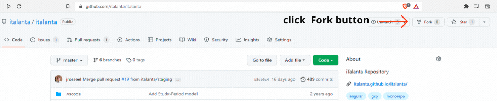
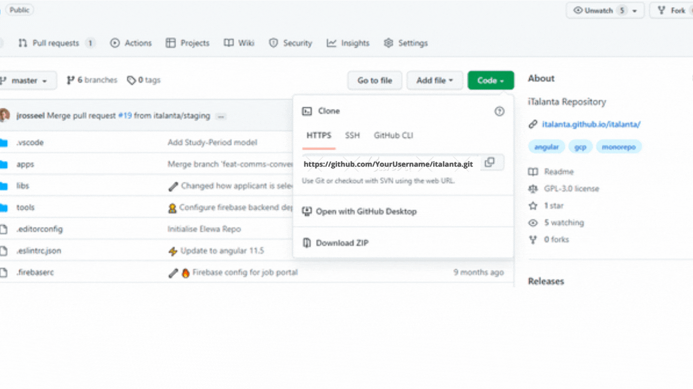
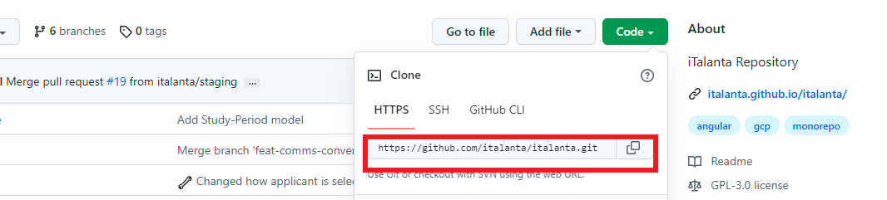
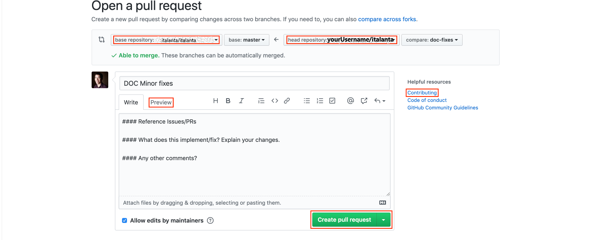
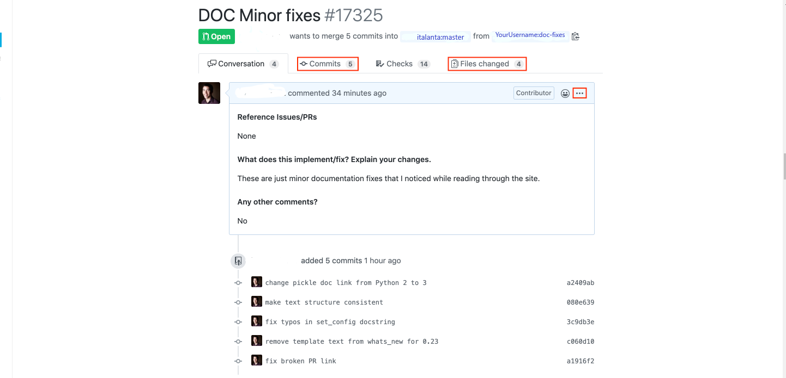

# Contributor's Guide

'HOW TO CONTRIBUTE TO OPEN SOURCE' accepts PR's (pull requests) from **newbies**
only. This is to help **newbies** get familiar with the contribution processes.

Issues can be submitted by anyone - either seasoned developers or newbies. [Go back to home page](./index.md)

**Contents**

- [Contributor's Guide](#contributors-guide)
    - [Getting Started](#getting-started)
    - [Submitting a Pull Request](#submitting-a-pull-request)

### Getting Started

&nbsp;
&nbsp;

1.  If you are new to Git and GitHub, it is advisable that you go through [Introduction to GitHub](https://lab.github.com/githubtraining/introduction-to-github)
    **before** moving to Step 2.

    &nbsp;
    &nbsp;

2.  Fork the [project](https://github.com/italanta/italanta) on GitHub. [Help Guide to Fork a Repository](https://docs.github.com/en/get-started/quickstart/fork-a-repo)

    

    &nbsp;
    &nbsp;

    

    &nbsp;
    &nbsp;

    This creates a new copy of [italanta repo](https://github.com/italanta/italanta) under your GitHub user account with a URL like:

        https://github.com/<YourUserName>/italanta

    In the upper left corner, you will see that you are now looking at a repository in your account:The copy includes all the code, branches, and commits from the original repo.
    
    &nbsp;
    &nbsp;

    
    
    &nbsp;
    &nbsp;

3. **Clone your fork** 
    

    &nbsp;
    &nbsp;

    While still in your repository, click the green Clone or download button and then copy the HTTPS URL:

    
    
    &nbsp;
    &nbsp;

    Using [Git](https://git-scm.com/) on your local machine, clone your fork using the URL you just copied. Clone the project by opening the terminal on your computer and running the command:

        git clone https://github.com/<YourUserName>/italanta
    
    
    (If you run into problems during this step, read the [Set up Git](https://docs.github.com/en/get-started/quickstart/set-up-git) page from GitHub's documentation.

    &nbsp;
    &nbsp;

4. **Navigate to your local repository**
    

    &nbsp;
    &nbsp;

    Since the clone was downloaded into a subdirectory of your working directory, you can navigate to it using: cd **italanta**.

        `cd italanta`

    &nbsp;
    &nbsp;

5. **Check that your fork is the "origin" remote**
    

    &nbsp;
    &nbsp;

    You are going to be synchronizing your local repository with both the project repository (on GitHub) and your fork (also on GitHub). The URLs that point to these repositories are called **remotes**. More specifically, the project repository is called the **upstream** remote, and your fork is called the **origin** remote.

    When you cloned your fork, that should have automatically set your fork as the **origin** remote. Use `git remote -v` to show your current remotes. You should see the URL of your fork (which you copied in step 3) next to the word **origin**.

    If you don't see an **origin** remote, you can add it using: `git remote add origin URL_OF_FORK`

    (If you run into problems during this step, read the [Managing remote repositories](https://docs.github.com/en/get-started/getting-started-with-git/managing-remote-repositories) page from GitHub's documentation.

    &nbsp;
    &nbsp;

6. **Add the project repository as the "upstream" remote**
    

    &nbsp;
    &nbsp;

    Go to your fork on GitHub, and click the "forked from" link to return to the project repository:

    <!--  -->
    

    &nbsp;
    &nbsp;

    While in the project repository, click the green Clone or download button and then copy the HTTPS URL:

    &nbsp;
    &nbsp;

    

    &nbsp;
    &nbsp;

    Add the project repository as the "upstream" remote using: `remote add upstream https://github.com/italanta/italanta.git`

    
        remote add upstream https://github.com/italanta/italanta.git

    Use git **remote -v** to check that you now have two remotes: an origin that points to your fork, and an upstream that points to the project repository.

    &nbsp;
    &nbsp;

    This diagram summarizes the entire setup process (steps 1 through 4):
    

    

    &nbsp;
    &nbsp;

7. **Pull the latest changes from upstream into your local repository**
    

    Rather than making changes to the project's "master" branch, it's a good practice to instead create your own branch. This creates an environment for your work that is isolated from the master branch.

    Use `git checkout -b BRANCH_NAME` to create a new branch and then immediately switch to it. The name of the branch should briefly describe what you are working on, and should not contain any spaces.

    For example, I used `git checkout -b doc-fixes` because I was making some small fixes to the documentation.

    Use `git branch` to show your local branches. You should see your new branch as well as "master", and your new branch should have an asterisk next to it to indicate that it's "checked out" (meaning that you're working in it).

    &nbsp;
    &nbsp;

8. **Make changes in your local repository**
    

    &nbsp;
    &nbsp;

    Use a text editor or IDE to make the changes you planned to the files in your local repository. Because you checked out a branch in the previous step, any edits you make will only affect that branch.
    
    &nbsp;
    &nbsp;

9.  **Commit your changes** 
    

    &nbsp;
    &nbsp;

    After you make a set of changes, use `git add -A` to stage your changes and `git commit -m "DESCRIPTION OF CHANGES"` to commit them.

    For example, I used `git commit -m "fix typos in set_config docstring"` for one of my commits.

    If you are making multiple sets of changes, it's a good practice to make a commit after each set.

    &nbsp;
    &nbsp;

10. **Push your changes to your fork**
    

    &nbsp;
    &nbsp;

    When you are done making all of your changes, upload these changes to your fork using `git push origin BRANCH_NAME`. This "pushes" your changes to the "BRANCH_NAME" branch of the "origin" (which is your fork on GitHub).

    For example, `git push origin doc-fixes`

    &nbsp;
    &nbsp;

### Submitting a Pull Request

If you decide to fix an issue, it's advisable to check the comment thread to see if there's somebody already working on a fix. If no one is working on it, kindly leave a comment stating that you intend to work on it. By doing that,
other people don't accidentally duplicate your effort.

In a situation where somebody decides to fix an issue but doesn't follow up
for a particular period of time, say 2-3 weeks, it's acceptable to still pick
up the issue but make sure that you leave a comment.

*Note*: Every open-source project has a **CONTRIBUTING.md** file, please make
sure to read this before you open up a pull request; otherwise, it may be
rejected. However, if you do not see any CONTRIBUTING.md file, you can send a
pull request but do it in a descriptive manner.

&nbsp;
&nbsp;

1. **Begin the pull request**
    

    &nbsp;

    Return to your fork on GitHub, and refresh the page. You may see a highlighted area that displays your recently pushed branch:

    

    &nbsp;
    &nbsp;
    &nbsp;

2.  **Create the pull request**
    

    &nbsp;
    &nbsp;

    When opening a "pull request", you are making a "request" that the project repository "pull" changes from your fork. You will see that the project repository is listed as the "base repository", and your fork is listed as the "head repository":

    &nbsp;

    

    Before submitting the pull request, you first need to describe the changes you made (rather than asking the project maintainers to figure them out on their own). You should write a descriptive title for your pull request, and then include more details in the body of the pull request. If there are any related GitHub issues, make sure to mention those by number. The body can include Markdown formatting, and you can click the **Preview** tab to see how it will look. On the right side, you may see a link to the project's **Contributing** guidelines. This is primarily worth reading through if you are submitting substantial code (rather than just fixing a typo), but it may still be worth scanning through at this point.Below the pull request form, you will see a list of the commits you made in your branch, as well as the "diffs" for all of the files you changed. If everything looks good, click the green **Create pull request** button!

    &nbsp;

    This diagram summarizes the entire pull request process:
    

    
    

    &nbsp;
    &nbsp;

3.  **Review the pull request**
    

    &nbsp;
    &nbsp;

    You have now created a pull request, which is stored in the project's repository (not in your fork of the repository). It's a good idea to read through what you wrote, as well as clicking on the **Commits** tab and the **Files changed** tab to review the contents of your pull request:

    

    &nbsp;
    &nbsp;

4.  **Synchronize your fork with the project repository after pull request success**
    

    At this point, your fork is out of sync with the project repository's master branch.

    To get it back in sync, you should first use Git to pull the latest changes from "upstream" (the project repository) into your local repository: `git pull upstream master`

    Then, push those changes from your local repository to the "origin" (your fork): git push origin master.

    This step is not strictly necessary, since you will pull changes from upstream before you make your next contribution to this project (step 7). However, this step is useful if you are going to clone your fork from another machine.

&nbsp;
&nbsp;
&nbsp;

Congratulations!
Congratulations on making your first open source contribution! 🎉 🎉 🎉 🎉 🎉 🎉 🎉 🎉

