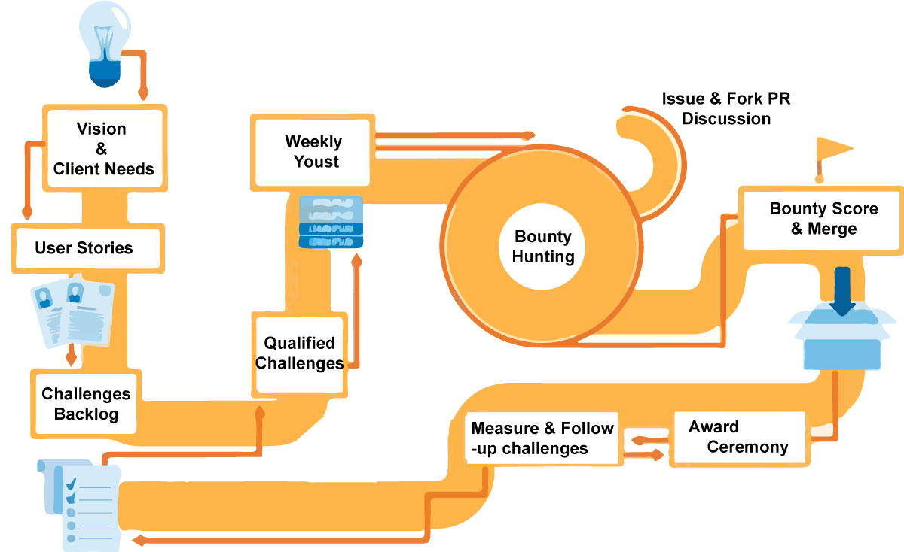

<div id="top"></div>
<!--
*** Credits to @othneildrew for development of this template.
*** Check out his work on : https://github.com/othneildrew/Best-README-Template
-->

<!-- PROJECT SHIELDS -->
[![Architects][architects-shield]][architects-url]
[![Guardians][guardians-shield]][guardians-url]
[![Knights][knights-shield]][knights-url]
[![Squires][squires-shield]][squires-url]
[![Challenges][challenges-shield]][challenges-url]
[![Challengers][challengers-shield]][challengers-url]
[![InReview][inreview-shield]][inreview-url]

[![MIT License][license-shield]][license-url]
[![LinkedIn][linkedin-shield]][linkedin-url]
[![Date][date-shield]][date-url]


<!-- PROJECT LOGO -->
<br />
<div align="center">
  <a href="https://italanta.net/for-devs">
    
  </a>

  <h3 align="center"><b>Karibu Sana!</b></h3>

  <p align="center">
    Welcome to the main repository of the iTalanta project, a project which combines the development of cutting-edge cloud-based software with opportunities for the development of the next generation of engineers.
    <br />
    <a href="#about-the-project"><strong>Get started »</strong></a>
    <br />
    <br />
    <a href="https://github.com/iote/italanta/blob/master/docs/convl/index.md">Conv. Learning Docs</a>
    ·
    <a href="https://github.com/iote/italanta/blob/master/docs/kijali/index.md">Kijali Docs</a>
    ·
    <a href="https://github.com/iote/italanta/issues">Request Feature</a>
    ·
    <a href="https://github.com/iote/italanta/issues">Report Bug</a>
  </p>
</div>

<br/>
<div>
  <h3>In partnership with</h3>
  <a href="https://moringaschool.com/">
    &nbsp;
  </a>
</div>

<br/>

<!-- TABLE OF CONTENTS -->
<details>
  <summary>Table of Contents</summary>
  <ol>
    <li>
      <a href="#about-the-project">Working on iTalanta OpenSource</a>
      <ul>
        <li><a href="#built-with">Our Technologies</a></li>
      </ul>
    </li>
    <li>
      <a href="#tournaments">Tournaments</a>
      <ul>
        <li><a href="#how-it-works">How it works</a></li>
        <li><a href="#joining-a-tournament">Registering for the program</a></li>
        <li><a href="#rewards-system">The Rewards & Bounty system</a></li>
        <li><a href="#bounty-evaluation">Bounty evaluation</a></li>
        <li><a href="#weekly-joust">The "Weekly Joust"</a></li>
      </ul>
    </li>
    <li>
      <a href="#ongoing-tournaments">Ongoing tournaments</a>
      <ul>
        <li><a href="#thecastle">The Castle</a></li>
        <li><a href="#convl">Elewa Conversational Learning</a></li>
      </ul>
    </li>
    <li>
      <a href="#upcoming-tournaments">Upcoming tournaments</a>
      <ul>
        <li><a href="#kijali">Kijali</a></li>
      </ul>
    </li>
    <li><a href="#contributing">Enrolling into the program</a></li>
    <li><a href="#license">License</a></li>
    <li><a href="#contact">Contact</a></li>
    <li><a href="#acknowledgments">Acknowledgments</a></li>
  </ol>
</details>

<!-- ABOUT THE PROJECT -->
<div id="about-the-project"></div>

# Working on iTalanta OpenSource

<!-- [![Product Name Screen Shot][product-screenshot]](https://example.com) -->

If you've made it here, you've probably heard about this new cool kid on the block called "<b>iTalanta Open Source</b>".

"iTalanta Open Source" is a collaboration between iTalanta and Moringa School to bridge the gap between new developers and the mystic achievement which is called "<b>Real-life Work Experience</b>". 

Here's how we'll get you there:

* Different real-world applications, <i>with real-world clients and business value</i>, are contained within this repository.
  
* These applications are maintained via an innovative new software development methodology called "<b>The Tournament</b>". The tournament is a derrivative of "<b>The Sprint</b>", and each application has it's own tournament.

* You compete in the Tournament by completing challenges, which consist out of tasks and bounties. These tasks and bounties are bugs, feature requests and/or other assignments that move the applications forward. You complete challenges by <b>having your fork's Pull Request merged into the code base</b>, and that fork can be maintained by either your team or individually.

* Bounties can earn you rewards, which are <b>experience points and/or cash rewards</b> for you and your team.
  
* Even if you miss the bounty, your fork will always be there. Stack your profile and portfolio with these forks and use them to convince recruiters that you can handle complex tasks. You can even brag how your solutions is better than the one accepted 😎.

* The <b>higher your experience, the more interesting the challenges</b> you can take part in.

The tournament is split into "<b>Weekly Jousts</b>". These are weekly events organised <b>every Tuesday</b> where new tasks and bounties are released. There can only be a limited number of challenges active at the same time, so if not all bounties have yet been completed by the start of the next week, less tasks and bounties will be released for the subsequent week.

Go to the "<a href="https://github.com/italanta/italanta/projects?type=beta">Jousting Board</a>" to review all current tournaments and challenges to get started, or read more about <a href="#how-it-works">how tournaments work</a> before continueing.

<p align="right">(<a href="#top">back to top</a>)</p>

<!-- Our Technologies -->
<div id="built-with"></div>

## Our Technologies

Our applications are built upon different toolsets and technologies. 

Technologies we currently use include:

* [Typescript](https://www.typescriptlang.org/)
* [Angular](https://angular.io/)
* [Material Design](https://material.io/design)
* [Photoshop, Illustrator & XD](https://www.adobe.com/)
* [Firebase & Firestore](https://firebase.google.com/)
* [Google Cloud & Cloud Functions](https://cloud.google.com)
* [NodeJS](https://nodejs.org/en/)
* [Amazon Web Services](https://aws.amazon.com/)
* [Botpress](https://github.com/botpress/botpress)
* [WhatsApp](https://business.whatsapp.com/)

For upcoming bounties, the following technologies will be included soon:

* [Flutter](https://flutter.dev/)
* [Python (Serverless & Data)](https://python.org)

<p align="right">(<a href="#top">back to top</a>)</p>


<!-- TOURNAMENTS -->
<div id="tournaments"></div>

# Tournaments

Tournaments are at the heart of our collaboration. Each application contained in this <a href="https://nx.dev/">NX</a> <a href="https://monorepo.tools/">monorepo</a> is developed and maintained through a (never-ending) tournament. The tournament has many different actors (jesters, squires, knights, guardians, smiths, ...), whom organise themselves as "<b>Guilds</b>" based on expertise. Then there's "<b>The Court</b>", which decides on the direction of the applications and writes out bounties and challenges.

You start out as a challenger, challenging the status quo of the application, allowing you to join- and gain reputation in Guilds. At the same time, you get to take home some nice bounty. Eventually, should you gain enough experience and reputation, you can even be challenged to earn you your own seat at The Court, resulting in a permanent employment offer from iTalanta.

<div id="how-it-works"></div>

## How Tournaments work

Tournaments are a new project management paradigm we have developed which are closely modelled after the <a href="https://www.scrum.org/resources/what-is-scrum">traditional sprints of the Scrum framework</a>, but optimised for distributed, asynchronous and diverse teams.

A tournament flows as follows:

<br/>



<br/>

We break down the phases step by step:

<br/>

1. <b><u>Product Vision, Client Needs and User Stories</u></b>
   
A tournament produces a digital application. A digital open-source asset which offers real value to an end user, in this case the client. Each tournament produces and maintains a different application. The application specifics (vision, feature descriptions, design philosophy, ...) of the tournament are described in the docs of each tournament.
  
<ul>
  <li><a href="">Product Vision : The Castle</a></li>
  <li><a href="">Product Vision : Conversational Learning</a></li>
  <li><a href="">Product Vision : Kijali</a></li>
</ul>

<br/>

2. <b><u>User Stories, Feature Design & Test Cases</u></b>

The product vision and client needs are further broken down into "<b><a href="https://www.scrum.org/resources/blog/myth-busting-what-user-story">User Stories</a></b>". These are a description of actions which users (<i>potentially of different persona</i>) would like to perform on the platform.

User stories typically have the following format: 
```
"As a *User_Type*, 

I wish to *Action_I_wish_to_perform*,

so that I *Reason_I_wish_to_perform_this*"
```

<br/>

3. <b><u>The Challenges Backlog</u></b>

The Castle develops these User Stories into challenges. Challenges include:

- The User Story
- <u>Feature description & Design</u>
- User Acceptence test cases
- A Bounty with experience points, goodie-bag, cash price or all three.

### The feature description

The user store and feature description provide you with all the guidance you require. A product is split into so-called "<b>Features</b>". Features can be as large as a dashboard, or as small as the typical "<b>it's just a button</b>".

<!--</b>" <i>(one of the certainties in life is clients telling you this specific sentence when requesting you to go over scope </i>😉<i>)</i>.-->

Each of these features has a design, technical description and technical/architectural guideline. These three elements combined provide competitors with the guidance required to hunt the bounty. 

Feature descriptions are published on the <a href="https://github.com/italanta/italanta/issues">issue board</a> with the tag <b>[WIP]</b>, which stands for "Work in Progress". Each of you can therefore participate in the design of feature from the very inception stage by leaving your comments, designs and suggestions on the design.

<br/>

4. <u><b>Qualified Challenges & The Weekly Youst</b></u>

After the design phase, features which are ready and complete are qualified. This means the **[WIP]**-tag is removed and they receive the **[qualified]**-tag. <a href="https://github.com/italanta/italanta/labels/qualified">Qualified issues</a> are issues which are completed from a feature-, technical- & design-description perspective and which can already be worked on. 

<h2 align="center">
  <b>A Qualified issue is what we call a Challenge!</b> 
</h2>
<br/>

During the "Weekly Youst", a weekly event which will take place every Wednesday afternoon, newly qualified challenges are presented and a bounty is attached to them. They move from **[qualified]** to **[active]** issues.

**[Active]** issues can be competitively <a href="#bounty-evaluation">submitted to The Court</a> for review and acceptance.

<br/>

5. <u><b>Bounty Hunting & scoring a bounty</b></u>

After all these steps, the real fun starts 🎉. As a challenger, your main role is to partake in the bounty-hunting phase. You score bounties by being the first to complete an open challenge.

If your code is accepted and merged into the codebase (*congratulations by the way, your code is absorbed into an enterprise grade, high-quality, project* 😲!) Through <a href="#the-castle">The Castle</a>, you can keep track of your won bounties and redeem them for rewards.

<a href="#contributing">Follow this link to understand in detail how this works.</a>

Happy coding ⌨️!

<br/>

6. <u><b>The Award Ceremony</b></u>

Once a month, after one of the Weekly Jousts, we hold an award ceremony 🏆 to celebrate those amongst us who completed a bounty. However, to compete and learn is much more important than winning.

We will therefore also take some time to compare different solutions to the same problem and learn from the different approaches, and we of course have to also celebrate all participants!

<br/>

7. <u><b>Products are never complete</b></u> ⛰️

As products are never complete, once your feature is released we will measure the impact of your change together with you through selected anonymized user data of the systems. 

This allows you to visualize your impact. At the same time, The Castle uses this data to inform the next set of user stories and challenges.

<p align="right">(<a href="#top">back to top</a>)</p>

<!-- #Section TAKING PART IN A TOURNAMENT -->
<div id="joining-a-tournament"></div>

## Registering for the program

**TODO !**

<!-- #Section BOUNTIES -->
<div id="rewards-system"></div>

## The Rewards & Bounty system

**TODO !**

<!-- #Section BOUNTY EVALUATION -->
<div id="bounty-evaluation"></div>

## Bounty Evaluation

**TODO !**

<!-- #Section WEEKLY YOUST -->
<div id="weekly-youst"></div>

## The "Weekly Youst"

**TODO !**
</br>

<!-- #Section WEEKLY YOUST -->
<div id="ongoing-tournaments"></div>

# Ongoing Tournaments

Currently, we have two open tournaments with challenges ready to take on (on program launch). 

These are:

<div id="thecastle"></div>

## O1. The Castle

Elewa Conversational Learning is a platform which manages <a href="https://www.elewa.education/project/conversational-learning/">Conversational Learning</a> programs. Conversational Learning is a form of digital learning that focusses on delivering <b>a learning experience as simple as having a conversation</b>, which at the same time delivers a richer and more learner-centered experience compared to traditional eLearning experiences. 

<p align="right"><b>- <a href="trnmnts/castle/index.md">Product Description</a></b></p>

<div id="convl"></div>

## O2. Elewa Conversational Learning

Elewa Conversational Learning is a platform which manages <a href="https://www.elewa.education/project/conversational-learning/">Conversational Learning</a> programs. Conversational Learning is a form of digital learning that focusses on delivering <b>a learning experience as simple as having a conversation</b>, which at the same time delivers a richer and more learner-centered experience compared to traditional eLearning experiences. 

<p align="right"><b>- <a href="trnmnts/convl/index.md">Product Description</a></b></p>

<div id="upcoming-tournaments"></div>

# Upcoming Tournaments

Another application is still under design. You can find this under:

<div id="kijali"></div>

## U1. Kijali

Kijali offers the rails for any startup-founder to run the financial operations of his/her business, starting from financial planning, all the way to accounting integrations.

<p align="right"><b>- <a href="trnmnts/kijali/index.md">Product Description</a></b></p>


<!--
### Installation

_Below is an example of how you can instruct your audience on installing and setting up your app. This template doesn't rely on any external dependencies or services._

1. Get a free API Key at [https://example.com](https://example.com)
2. Clone the repo
   ```sh
   git clone https://github.com/your_username_/Project-Name.git
   ```
3. Install NPM packages
   ```sh
   npm install
   ```
4. Enter your API in `config.js`
   ```js
   const API_KEY = 'ENTER YOUR API';
   ```

<p align="right">(<a href="#top">back to top</a>)</p>
-->


<!-- USAGE EXAMPLES 
## Usage

Use this space to show useful examples of how a project can be used. Additional screenshots, code examples and demos work well in this space. You may also link to more resources.

_For more examples, please refer to the [Documentation](https://example.com)_

<p align="right">(<a href="#top">back to top</a>)</p>

-->

<!-- ROADMAP 
## Roadmap

- [x] Add Changelog
- [x] Add back to top links
- [ ] Add Additional Templates w/ Examples
- [ ] Add "components" document to easily copy & paste sections of the readme
- [ ] Multi-language Support
    - [ ] Chinese
    - [ ] Spanish

See the [open issues](https://github.com/othneildrew/Best-README-Template/issues) for a full list of proposed features (and known issues).

<p align="right">(<a href="#top">back to top</a>)</p>

-->

<!-- CONTRIBUTING -->
# Contributing

Contributions are what make the open source community such an amazing place to learn, inspire, and create. Any contributions you make are **greatly appreciated**.

If you have a suggestion that would make this better, please fork the repo and create a pull request. You can also simply open an issue with the tag "enhancement".
Don't forget to give the project a star! Thanks again!

1. [Contributing to the project](./contribution.md)
2. [View Leaderboard](./leaderboard.md)


<p align="right">(<a href="#top">back to top</a>)</p>


<!-- LICENSE -->
## License

Distributed under the GPLv3 License. See `LICENSE` for more information.

<p align="right">(<a href="#top">back to top</a>)</p>


<!-- CONTACT -->
## Contact

Your Name - [@your_twitter](https://twitter.com/your_username) - email@example.com

Project Link: [https://github.com/your_username/repo_name](https://github.com/your_username/repo_name)

<p align="right">(<a href="#top">back to top</a>)</p>


<!-- ACKNOWLEDGMENTS -->
## Acknowledgments

Use this space to list resources you find helpful and would like to give credit to. I've included a few of my favorites to kick things off!

* [Choose an Open Source License](https://choosealicense.com)
* [GitHub Emoji Cheat Sheet](https://www.webpagefx.com/tools/emoji-cheat-sheet)
* [Malven's Flexbox Cheatsheet](https://flexbox.malven.co/)
* [Malven's Grid Cheatsheet](https://grid.malven.co/)
* [Img Shields](https://shields.io)
* [GitHub Pages](https://pages.github.com)
* [Font Awesome](https://fontawesome.com)
* [React Icons](https://react-icons.github.io/react-icons/search)

<p align="right">(<a href="#top">back to top</a>)</p>


<!-- MARKDOWN LINKS & IMAGES -->

<!-- Guardians. Define the -->
[architects-shield]: https://img.shields.io/badge/Architects-1-blue?style=for-the-badge
[architects-url]: https://github.com/iote/italanta/contributors.md#architects

[guardians-shield]: https://img.shields.io/badge/Guardians-3-blue?style=for-the-badge
[guardians-url]: https://github.com/iote/italanta/contributors.md#guardians

[guardians-shield]: https://img.shields.io/badge/Guardians-3-blue?style=for-the-badge
[guardians-url]: https://github.com/iote/italanta/contributors.md#guardians

[knights-shield]: https://img.shields.io/badge/Knights-9-blue?style=for-the-badge
[knights-url]: https://github.com/iote/italanta/contributors.md#knights

[squires-shield]: https://img.shields.io/badge/Squires-6-blue?style=for-the-badge
[squires-url]: https://github.com/iote/italanta/contributors.md#squires

<!-- Challengers -->

[challenges-shield]: https://img.shields.io/badge/Open%20Challenges-8-orange?style=for-the-badge
[challenges-url]: https://github.com/iote/italanta/contributors.md#challenges

[challengers-shield]: https://img.shields.io/badge/Challengers-0-yellow?style=for-the-badge
[challengers-url]: https://github.com/iote/italanta/contributors.md#challengers

[inreview-shield]: https://img.shields.io/badge/In%20review-0-green?style=for-the-badge
[inreview-url]: https://github.com/iote/italanta/contributors.md#challenge-in-review

[license-shield]: https://img.shields.io/badge/License-GPLv3-lightgray?style=for-the-badge
[license-url]: https://github.com/iote/italanta/blob/master/LICENSE

[linkedin-shield]: https://img.shields.io/badge/-LinkedIn-black.svg?style=for-the-badge&logo=linkedin&colorB=555
[linkedin-url]: https://www.linkedin.com/company/italanta

[date-shield]: https://img.shields.io/badge/Date-01%2006%202022-green?style=for-the-badge
[date-url]: https://github.com/iote/italanta

[product-screenshot]: images/screenshot.png