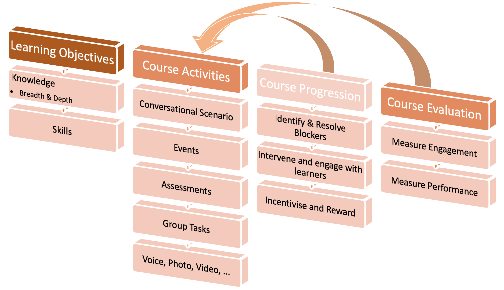

# Elewa Conversational Learning

(<a href="../../index.md">back to Home</a>)

Elewa Conversational Learning is a platform which manages <a href="https://www.elewa.education/project/conversational-learning/">Conversational Learning</a> programs. 

Conversational Learning is a form of digital learning that focusses on delivering <b>a learning experience as simple as having a conversation</b>, which at the same time delivers a richer and more learner-centered experience compared to traditional eLearning experiences. 

The courses can be deployed to different channels such as <a href="https://business.whatsapp.com/">WhatsApp</a>, <a href="https://developers.facebook.com/docs/messenger-platform/">Messenger</a>, <a href="https://core.telegram.org/">Telegram</a> and custom apps of your own design.

The platform wraps around open-source chatbot authoring tools (soon migrating to an open-source one e.g. <a href="https://github.com/botpress">BotPress</a>) on which the Conversational Learning courses can be developed, and manages the deployment of the courses and the follow-up of learner progression.

 

## Key Objectives & Features

The key objectives of the application are in line with the <a href="learning-design-process.md">learning design and execution flow</a>*:

- **To simplify the development of Conversational Learning programs**, through easy-to-use and integrated scenario authoring tools. 

- To allow for **multi-channel engagements/course designs** for learners.

- To enable easy, **"one-click deployment"** of Conversational Learning programs.

- To provide a platform for Conversational Learning "Operations", where teachers can **monitor individual learner progress and engage** with the learners in chat through the platform, as well as launch **class-wide campaigns**, amongst other operations..

- To provide **useful insights** concerning overall learner progression and course satisfaction. These include general insights and those measured against the specific learning objectives.

 

'* <a href="learning-design-process.md">*Learning design and execution flow*</a>

## Course Lifetime & Features

The objectives above illustrate the typical lifetime of a course. There are two main phases in running a ;

1. **The Planning & Design Phase**   
   During the planning and Design Phase, we map out course objectives and develop a first version of the course. 

   Key features include:
  
    - <u>Organisation, Course & Channel Management</u>
     
    An organisation can hold different courses. A module is therefore necessary to manage the organisation's information, it's courses and it's channels.

    - <u>Course content author</u>
     
    An authoring tool for content of the course, in Conversational Learning format. The authoring tool is very visual so that non-technical users can also design their conversations in a suitable manner. The content furthernore requires some sort of version control and modularisation to allow for a smooth content-development experience.

    - <u>Objective Mapper</u>
     
    A visual tool for setting and mapping learning objectives. Allows for designers to define metrics which can integrate with the flow of the application.

    Based on feedback from the Operational Phase, course designers might iterate back to the Design Phase to implement changes which address bottlenecks or smoothen the experience.

2. **The Operational Phase** 
    The Operational Phase is different as it consists of actual course operations. This means students are onboarding and taking the course. To make this smoothly, we need a set of different features:
   
    - <u>Course & Chatbot engine</u>
     
    At the core of executing a course we of course require a course model which can interpret our Conversational Learning/Chatbot scripts. The engine can launch nodules, execute scenarios, remember local context,and more.

    - <u>Manual Operator Mode</u>
     
    In Manual Operator Mode, an operator can view the complete chat history with a student and take over from the robot for a one-on-one conversation with the student. Procedures to hand over control back/forth between the bot and student exist, as well as items such as quality control surveys after the conversation. Next to holding conversation, the human agent can send the student to certain scenarios, send and receive documents, and more.

    - <u>Analytics Module</u>
     
    To follow up on course uptake, student progression, module progression, ..., different analytics module- and page- (e.g. dashboard, A/B test, ...) features exist.

