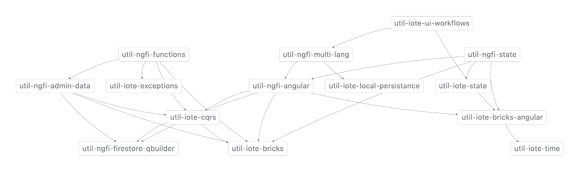

# Utilities & Global Libraries

This section of the repository contains general purpose libraries that are useful outside of the context of the iTalanta applications. Each of the libraries is published to npm under the @iote/*lib_name* and @ngfi/*lib_name* prefixes.

The following helper libraries are contained in this repo:

## @iote

@iote libraries are general purpose that help with both common (no dependency) and Angular-specific projects.

## @ngfi

@ngfi libraries are general purpose but all have dependency on the use of Angular and/or Firebase.
